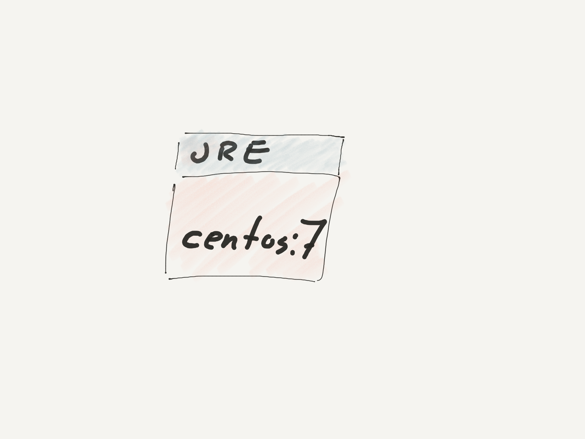
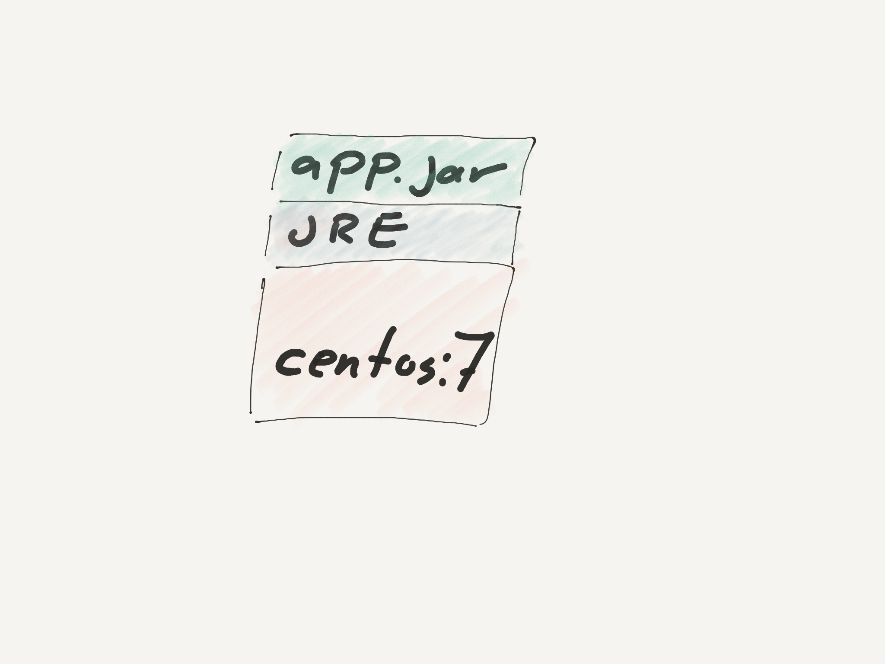
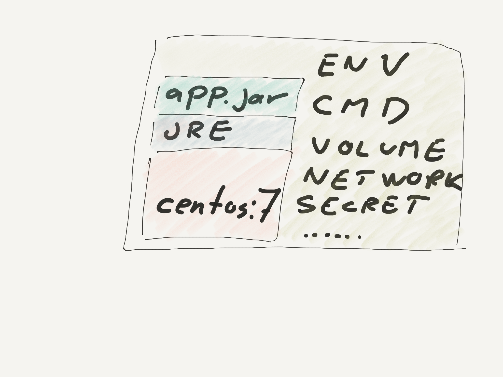

:data-transition-duration: 300
:css: css/presentation.css
:data-rotate-x: 360
:skip-help: true

.. title:: Introduction to Docker

.. header::

   .. image:: images/logo.jpg

.. footer::

    Introduction to Docker

Docker
======

Sopra Steria

Microservices and Container Platform Community

2017-08-22

----

whoami
======

.. code-block:: shell-session

   $ getent passwd ssm
   ssm:x:1000:1000:Stig Sandbeck Mathisen:/home/ssm:/bin/zsh

* Lead Infrastructure Engineer
* Team Leader @ TOD
* Debian Developer
* Red Hat Certified Architect

----

What is Docker
==============

Docker is a way to...

* Package software
* Publish software
* Isolate software

----

Where can I use it?
===================

* Linux
* Windows
* MacOS

.. note::

   Windows and MacOS runs a Linux VM.

   Windows can run Windows containers.

----

How does it work?
=================

* Disk image with application and dependencies
* External configuration and data storage
* Separate networking
* Separate storage
* Separate users and groups

.. note::

  Disk image is immutable

  Look at namespacing and cgroups in Linux.

----

What problems does it solve?
============================

* Reproducability
* Transparency
* "It works on my laptop"

----

A short history of containers
=============================

* 1999: FreeBSD jail
* 2001: Linux-Vserver (...)
* 2004: Solaris zones
* 2013: Docker
* Standardised containers  <---- YOU ARE HERE

----

Docker on the Command Line
==========================

The "docker" command.

----

How do I use this thing?
------------------------

"docker run" will download a docker image and start a container.

.. code-block:: shell-session

   # docker run -it centos:7

   # docker run -it debian:unstable

----

Instant OS instance
-------------------

Download and test Debian unstable.

.. code-block:: shell-session

  user@laptop $ docker run -it debian:unstable
  Unable to find image 'debian:unstable' locally
  unstable: Pulling from library/debian
  19b593653f02: Pull complete
  Digest: sha256:6b8a5bdcc30b79c3740efa654153d834c09[...]
  Status: Downloaded newer image for debian:unstable
  root@adc34b017b94:/#

----

Instant application test
------------------------

Download and test splunk.

.. code-block:: shell-session

   user@laptop $ docker run --name splunk --hostname splunk \
     -p "8000:8000" -d -e "SPLUNK_START_ARGS=--accept-license" \
     splunk/splunk:6.6.1

----

Building images
---------------

.. code-block:: shell-session

  user@laptop $ ls -l
  total 8
  -rw-r--r--  1 user  user  256 Aug 22 15:46 Dockerfile

  user@laptop $ docker build .

  user@laptop $ docker build -t myapp:test .

  # docker tag registry.example.com/myapp:v1 myapp:test

.. note::

  Dockerfile, we'll get to that soon.

----

Pulling and pushing images
--------------------------

.. code-block:: shell-session

   # docker pull debian:9

   # docker pull registry.example.com/base:latest

   # docker push registry.example.com/myapp:latest

----

Running images
--------------

.. code-block:: shell-session

   # docker run -it registry.example.com/myapp:latest /bin/bash

.. note::

  The command to run can be set for a docker image.  Override it explicitly.

  See what it is with "docker inspect"

----

Building Docker images
======================

----

Start with a base OS
--------------------

.. code-block:: docker

   FROM centos:7

----

Include a runtime environment
-----------------------------

.. code-block:: docker

   FROM centos:7
   RUN yum -y install jre...

----

Add your application
--------------------

.. code-block:: docker

   FROM centos:7
   RUN yum -y install jre...
   ADD https://artifactory.example.com/app.jar /srv/app.jar
   CMD java -jar /srv/app.jar

----

An docker container
-------------------

.. code-block:: shell-session

  user@host $ docker run -it myapp

----

Storage
=======

All docker containers have a writable layer.

Data written to container.

* Same lifetime as the container
* Managed by the storage driver
* Storage driver has performance overhead

Use a data mount.

----

Volumes
-------

* Persistent storage
* Managed by docker (/var/lib/docker/...)

----

Bind mounts
-----------

* Persistent storage
* Mounted from anywhere on the host filesystem

----

tmpfs mounts
------------

* For performance
* Mounted from host tmpfs
* Stored in memory (or swap)
* Same lifetime as container

.. note::

  Just for speed. Data is lost with container.  Avoids the overhead of the storage driver.

----

Networking
==========

Most developer setups share network with the host.

Can be as complex as you want, and even more.

----

Demo
====

----

That's it
=========

Takk for meg.
