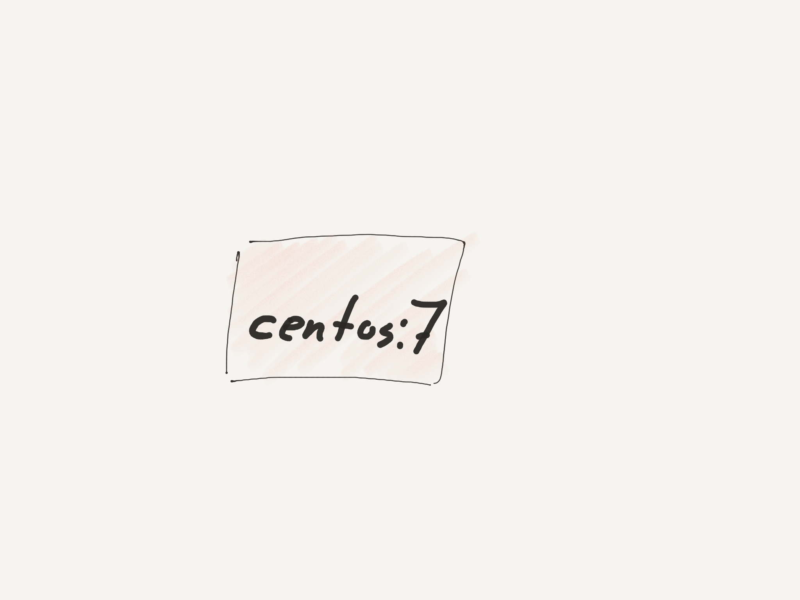
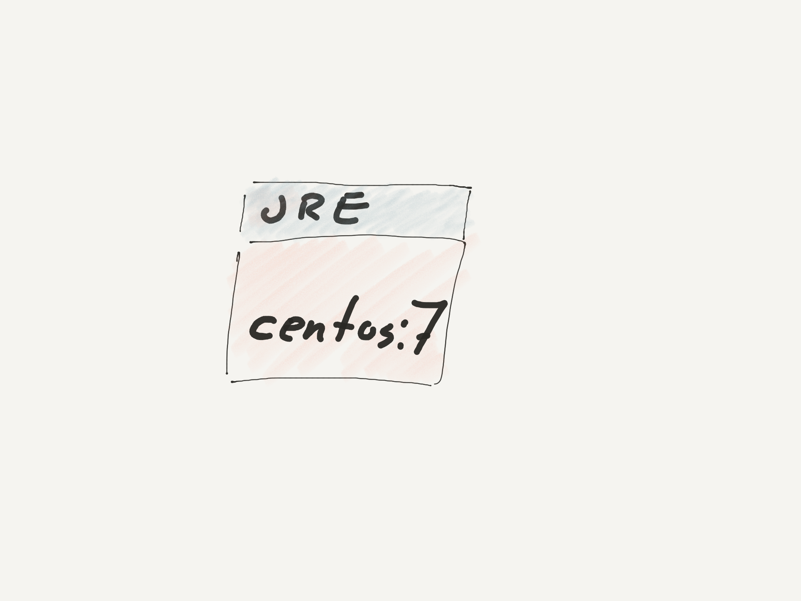
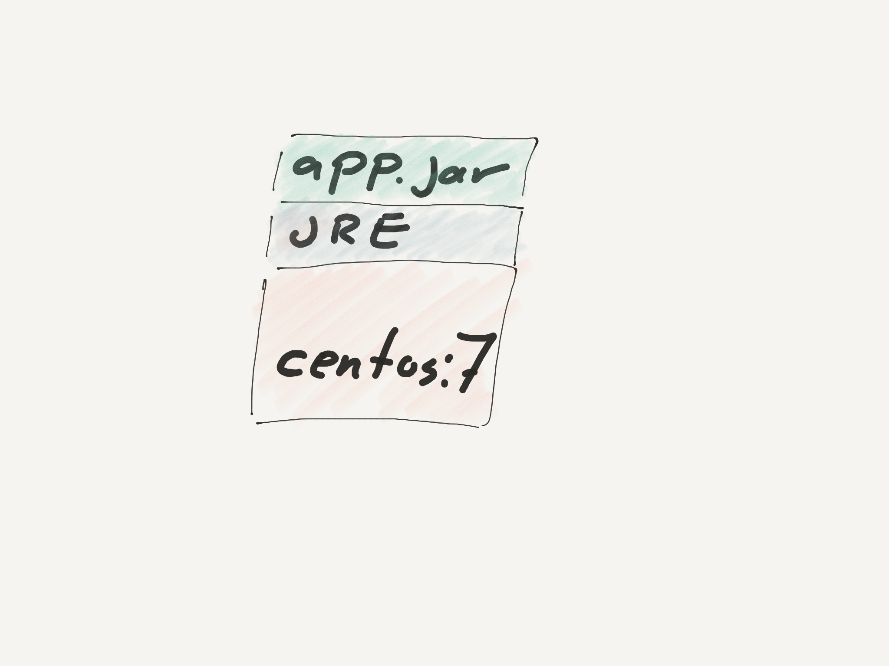

:data-transition-duration: 200
:css: css/presentation.css
:data-rotate-x: 20

.. title:: Docker

.. header::

   .. image:: images/logo.jpg

.. footer::

    Introduction to Docker, Stig Sandbeck Mathisen, Sopra Steria 2017

Docker
======

Sopra Steria, Microservices and Container Platform Community

2017-08-22

----

whoami
======

::

   # getent passwd ssm
   ssm:x:1000:1000:Stig Sandbeck Mathisen:/home/ssm:/bin/zsh

* Lead Infrastructure Engineer
* Debian Developer
* Red Hat Certified Architect

----

What is Docker
==============

----

A short history of containers
=============================

* FreeBSD jail
* Solaris zones
* Linux-Vserver, OpenVZ...
* Docker
* Standardised containers  <---- YOU ARE HERE
* And then what?

----

Docker images
=============

----

----

----

----

Docker instance
===============

----

Docker on the Command Line
==========================

----

Docker service
==============

----

Storage
=======

----

Networking
==========

----

Demo
====

----

That's it
=========

Thank you!
